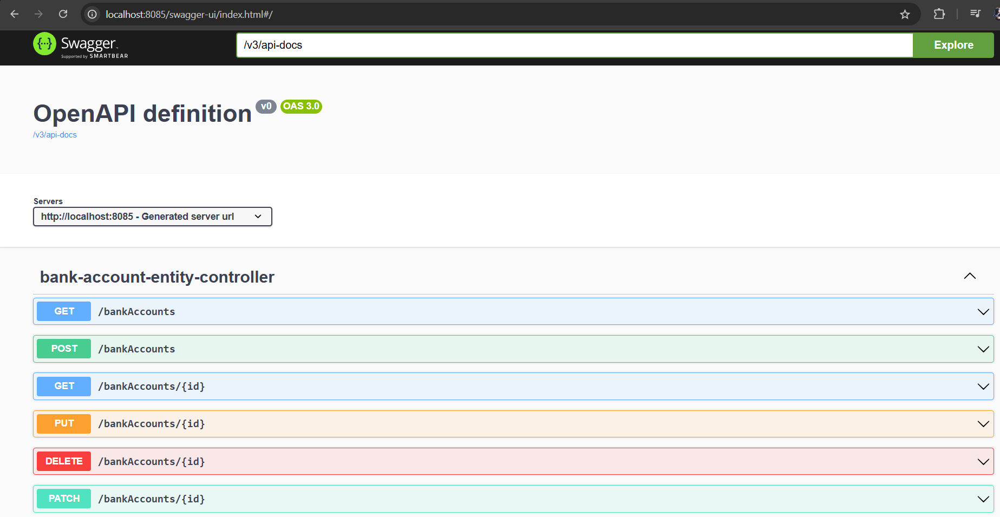

<h3>Description de Project</h3>

Travail à faire :
1. Créer un projet Spring Boot avec les dépendances Web, Spring Data JPA, H2, Lombok 
2. Créer l'entité JPA Compte 
3. Créer l'interface CompteRepository basée sur Spring Data 
4. Tester la couche DAO 
5. Créer le Web service Restfull qui permet de gérer des comptes 
6. Tester le web micro-service en utilisant un client REST comme Postman 
7. Générer et tester le documentation Swagger de des API Rest du Web service 
8. Exposer une API Restful en utilisant Spring Data Rest en exploitant des projections 
9. Créer les DTOs et Mappers 
10. Créer la couche Service (métier) et du micro service 
11. Créer un Web service GraphQL pour ce Micro-service 

-----------------------------------------------------------------------------------

<h3>Api Data Rest BankAccount </h3>

 
<h3>Get Account By Id: Postman </h3>

 
<h3>List BankAccounts: Postman </h3>

 

<h3>Swagger Api Data-Rest</h3>

 
<h3>Schema GraphQl</h3>

 
<h3>GraphQl Get Accounts</h3>

 
<h3>GraphQl Add Accounts</h3>

 
<h3>H2 DataBase</h3>

 